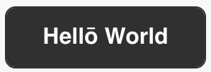
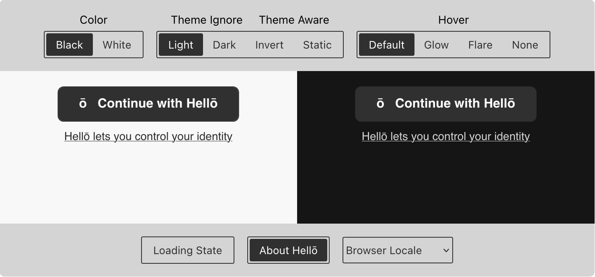
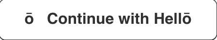

# <HellōButton/> for React

## Usage

```javascript
import { HelloButton } from "@hellocoop/react"

function Foo() {
  // see https://www.hello.dev/documentation/Integrating-hello.html#_2-create-request-url to create a request url
  const login = () => (window.location.href = requestUrl)
  return <HelloButton onClick={login} />
}

/* All props
    <HelloButton
        onClick={login}
        loading={false}
        disabled={false}
        tooltip={true}
        variant="hello-btn-white-on-dark"
        hoverVariant="hello-btn-hover-flare"
        lang="ar"
        customLabel="Hellō World"
    />
*/
```

## Props

| Name         | Type                         | Default                                  | Description/Output                                                                                                                        |
| ------------ | ---------------------------- | ---------------------------------------- | ----------------------------------------------------------------------------------------------------------------------------------------- |
| onClick      | function                     | `() => {}` (no-op)                       | Called on click of Hellō button                                                                                                           |
| loading      | boolean                      | `false`                                  | <br/>(best used in conjunction with `disabled` prop)           |
| disabled     | boolean                      | `false`                                  | Disables the Hellō button (best used in conjunction with `loading` prop)                                                                  |
| tooltip      | boolean                      | `true`                                   |                                                                |
| variant      | string [enum](#variant)      | `hello-btn`                              | Controls style of the Hellō button                                                                                                        |
| hoverVariant | string [enum](#hoverVariant) | none                                     | Controls hover effect of the Hellō button                                                                                                 |
| lang         | string [enum](#lang)         | `window.navigation.language \|\| "en"`   | Language of the Hellō button, about button and text                                                                                       |
| customLabel  | string                       | "ō&nbsp;&nbsp;&nbsp;Continue with Hellō" | Overwrite the default button Hellō Button text <br/> |

### Styling

`variant` and `hoverVariant` props controls the styling of the Hellō Button.

Play with the different button styles at [hello.dev](https://www.hello.dev/documentation/getting-started.html#_2-standard-hello-buttons).



#### `variant`

The values suffixed with `invert` and `static` are theme aware.

| Value                      | Example Output (Light Mode)                                                                                       |
| -------------------------- | ----------------------------------------------------------------------------------------------------------------- |
| Default                    |                                        |
| hello-btn-black-on-light   |                       |
| hello-btn-black-on-dark    |        |
| hello-btn-white-on-light   |      |
| hello-btn-white-on-dark    |        |
| hello-btn-white-and-invert |  |
| hello-btn-black-and-invert |  |
| hello-btn-black-and-static |  |
| hello-btn-white-and-static |  |

#### `hoverVariant`

| Value                 | Example Output (Default Variant + Light Mode)                                                           |
| --------------------- | ------------------------------------------------------------------------------------------------------- |
| Default               |                              |
| hello-btn-hover-glow  |    |
| hello-btn-hover-flare |  |
| `hello-btn-hover-none |                 |

#### Advanced Styling

Internally `<HelloButton/>` renders the markup

```html
<div class="hello-container">
   <button class="hello-btn>ō&nbsp;&nbsp;&nbsp;Continue with Hellō</button>
   <div class="hello-about-conatiner">
       <button class="hello-about-btn">
           Hello lets you control your identity
       </button>
       <span class="hello-about-bubble">
           Hellō is a personal identity wallet that lets you choose what you share, how you authenticate,
           and how you recover your wallet. Hellō remembers who you are and protects your privacy.
       </span>
   </div>
</div>
```

If you want to apply additional styles, the `HelloButton` component accepts a `style` and `className` prop as well, values which gets applied to the `.hello-btn` node.

You can also add/overwrite targetting classes per the markup above.

```
.hello-container {
    /*
       top level container holding the Hellō button,
       about button and bubble
    */
}
.hello-btn {
    // Hellō button
}
.hello-about-container {
    // container for hello about button and bubble
}
.hello-about-btn {
    // Hellō about button
}
.hello-about-bubble {
    // Hellō about bubble
}
```

### Locales

#### lang

| Value            | Language | Output                                                                 |
| ---------------- | -------- | ---------------------------------------------------------------------- |
| en<br/>(Default) | English  |  |
| hi               | Hindi    |       |
| ar               | Arabic   |       |
| de               | German   |       |
| fr               | Frarch   |       |
| es               | Spanish  |       |

Don't see your locale? We encourage you to create a translation for your locale per
[hellocoop/wallet-i18n](https://github.com/hellocoop/wallet-i18n) and submit a pull request for review.
