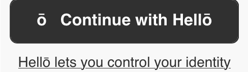
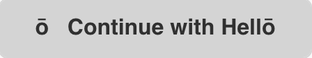
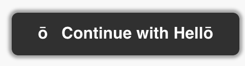
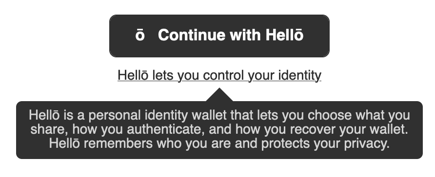
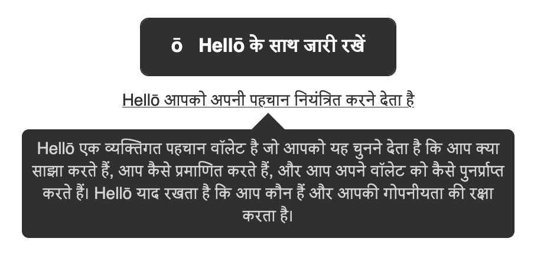
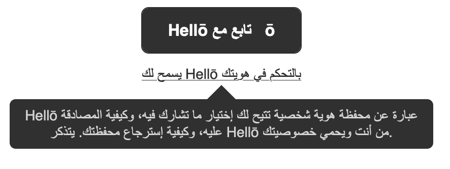
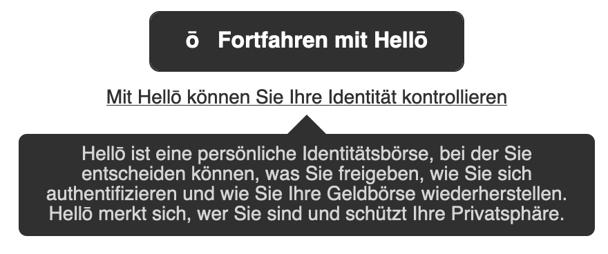
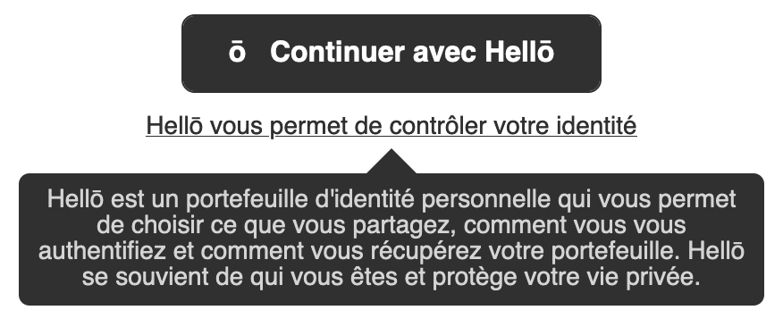
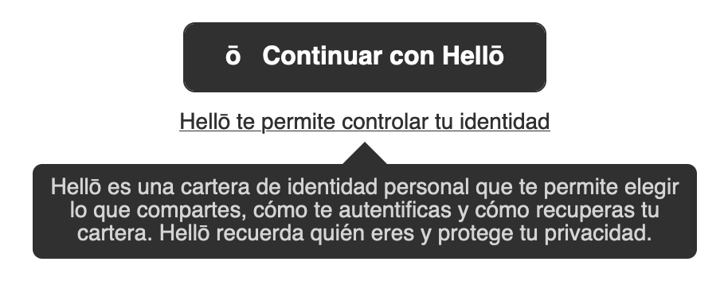

# Hellō Button Component for React

## Usage

```javascript
import { HelloButton } from "@hellocoop/react"

function Foo() {
  // see https://www.hello.dev/documentation/Integrating-hello.html#_2-create-request-url to create a request url
  const login = () => (window.location.href = requestUrl)
  return <HelloButton onClick={login} />
}
```

## Props

| Name         | Type            | Default                                  | Description/Output                                                              |
| ------------ | --------------- | ---------------------------------------- | ------------------------------------------------------------------------------- |
| onClick      | function        | `() => {}` (no-op)                       | Called on click of Hellō button                                                 |
| loading      | boolean         | `false`                                  |  |
| disabled     | boolean         | `false`                                  | Disables the Hellō button (best used in conjunction with `loading` prop)        |
| tooltip      | boolean         | `true`                                   |                                           |
| variant      | string [enum]() | `hello-btn`                              | Controls style of the Hellō button                                              |
| hoverVariant | string [enum]() | none                                     | Controls hover effect of the Hellō button                                       |
| lang         | string [enum]() | `window.navigation.language \|\| "en"`   | Language of the Hellō button, about button and text                             |
| customLabel  | string          | "ō&nbsp;&nbsp;&nbsp;Continue with Hellō" | Overwrite the default button Hellō Button text                                  |

### Styling

`variant` and `hoverVariant` props controls the styling of the Hellō Button.

Play with the different button styles at [hello.dev](https://www.hello.dev/documentation/getting-started.html#_2-standard-hello-buttons).

#### `variant`

The values suffixed with `invert` and `static` are theme aware.

| Value                        | Example Output (Light Mode)                                              |
| ---------------------------- | ------------------------------------------------------------------------ |
| Default                      |                                    |
| `hello-btn-black-on-light`   |                   |
| `hello-btn-black-on-dark`    |    |
| `hello-btn-white-on-light`   |  |
| `hello-btn-white-on-dark`    |    |
| `hello-btn-white-and-invert` |  |
| `hello-btn-black-and-invert` |  |
| `hello-btn-black-and-static` |  |
| `hello-btn-white-and-static` |  |

#### `hoverVariant`

| Value                   | Example Output (Default Variant + Light Mode)                      |
| ----------------------- | ------------------------------------------------------------------ |
| Default                 |                              |
| `hello-btn-hover-glow`  |    |
| `hello-btn-hover-flare` |  |
| `hello-btn-hover-none`  |                 |

#### Advanced Styling

Internally `<HelloButton/>` renders the markup

```html
<div class="hello-container">
   <button class="hello-btn>ō&nbsp;&nbsp;&nbsp;Continue with Hellō</button>
   <div class="hello-about-conatiner">
       <button class="hello-about-btn">
           Hello lets you control your identity
       </button>
       <span class="hello-about-bubble">
           Hellō is a personal identity that lets...
       </span>
   </div>
</div>
```

If you want to apply additional styles, the `HelloButton` component accepts a `style` and `className` prop as well, values which gets applied to the `.hello-btn` node.

You can also add/overwrite targetting classes per the markup above.

```
.hello-container {
    /*
       top level container holding the Hellō button,
       about button and bubble
    */
}
.hello-btn {
    // Hellō button
}
.hello-about-container {
    // container for hello about button and bubble
}
.hello-about-btn {
    // Hellō about button
}
.hello-about-bubble {
    // Hellō about bubble
}
```

### Locales

#### lang

| Value        | Language | Output                            |
| ------------ | -------- | --------------------------------- |
| en (Default) | English  |  |
| hi           | Hindi    |  |
| ar           | Arabic   |  |
| de           | German   |  |
| fr           | French   |  |
| es           | Spanish  |  |

Don't see your locale? We encourage you to create a translation for your locale per
hellocoop/wallet-i18n and submit a pull request for review.
